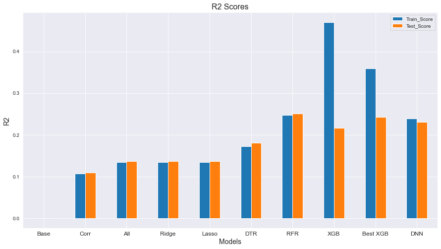

[Image](https://www.edmsauce.com/wp-content/uploads/2017/01/6360041936368655181636978495_shutterstock_200035424.jpg)

# what's spoppin'?

#### Author: Erin Vu

## Overview

This project is an analysis and prediction of popularity of Spotify tracks from the Kaggle datset in order to provide music production companies with a good idea of the attributes of popular songs. As a result of iterating through linear regression and random forest regression models, the most impactful feature through random forest regression was acousticness and can recommend to not release primarily acoustic songs.

## Business Problem 

The business problem for our music production stakeholders is what attributes make a popular song. Music production companies need to know generally what people like to listen to, and with this project we can find those optimal features. We will be using linear regression and random forest regression to predict popularity of songs based on the feature data. With this information, production companies will be able to produce new popular songs.

## Data 

The [Spotfy dataset from Kaggle](https://www.kaggle.com/yamaerenay/spotify-dataset-19212020-160k-tracks) has almost 600,000 songs from the years 1922-2021, and has 20 columns. The target variable is Popularity and the other features wil be used to predict the target variable. The variables are listed below as they were in the dataset descriptionset on Kaggle and the main predictor variables for this will be the numerical features such as acousticness, danceability, energy, etc. To follow along with this repository, please fork this repository, and download the dataset from Kaggle into the /data folder.

#### Primary:

id (Id of track generated by Spotify)

#### Numerical:

acousticness (Ranges from 0 to 1)

danceability (Ranges from 0 to 1)

energy (Ranges from 0 to 1)

duration_ms (Integer typically ranging from 200k to 300k)

instrumentalness (Ranges from 0 to 1)

valence (Ranges from 0 to 1)

popularity (Ranges from 0 to 100)

tempo (Float typically ranging from 50 to 150)

liveness (Ranges from 0 to 1)

loudness (Float typically ranging from -60 to 0)

speechiness (Ranges from 0 to 1)

#### Dummy:

mode (0 = Minor, 1 = Major)

explicit (0 = No explicit content, 1 = Explicit content)

#### Categorical:

key (All keys on octave encoded as values ranging from 0 to 11, starting on C as 0, C# as 1 and so on…)

timesignature (The predicted timesignature, most typically 4)

artists (List of artists mentioned)

artists (Ids of mentioned artists)

release_date (Date of release mostly in yyyy-mm-dd format, however precision of date may vary)

name (Name of the song)

Below is the distribution of our target variable, popularity.


Below we can observe the correlations of the features with our target.


## Methods

By using Python and it's packages such as numpy and pandas, we explored the data's features and their relationship to our target variable, popularity. After exploration, we used other libraries such as scikit-learn and xgboost to model our predictions. Within scikit-learn, we iterated through linear regression and random forest regression models to predict popularity. We then used xgboost to further explore other models that might improve our score. The metric used to evaluate the models were the RMSE score. The R2 score was also observed.

## Results

The RMSE scores between the train and test set for our linear regression models were almost the same, indicating that the training and test predictions performed roughly the same. The decision tree model also performed roughly the same on the training and validation set. The random forest regression model and the XGBoost models performed poorer on the validation set, indicating those models were overfit. The models were slightly over fit, but they still performed better than our baseline model and although the random forest regression cross validated model and the xgboost cross validated models scored similarly in RMSE, the random forest model performed much better on the test set when looking at our R2 scores. With these results, we are somewhat confident in our best model, the random forest regression model, and its ability generalize and predict popularity.




Below we can see the feature importances extracted from the random forest regression model. Artists and count has a huge impact on predicting popularity. The following images shows the importance while excluding those.


## Conclusions

As a result of this project, I believe we can recommend music production studios to make new songs with popular artists and to make the songs lean on the side of not acoustic and have instruments included. Some reasons why this analysis might not fully solve the problem is due to the parameter tuning of the model and the size of the data. Subsetting the data and dividing it out into genre models will most likely lead to better predictions for specific songs, which is also a next step improvement on the project. 

## For More Information

Please review the full analysis in the [Jupyter Notebook](https://github.com/ekvu/whats_spoppin/blob/main/mvp_notebook.ipynb) or the [presentation](https://github.com/ekvu/whats_spoppin/blob/main/mvp_presentation.pdf). For any additional questions, please contact me at erin.vu94@gmail.com.

## Repository Structure

```
├── README.md                         
├── pickle
├── mvp_notebook.ipynb
├── mvp_presentation.pdf        
├── data                                
└── images                             
```
